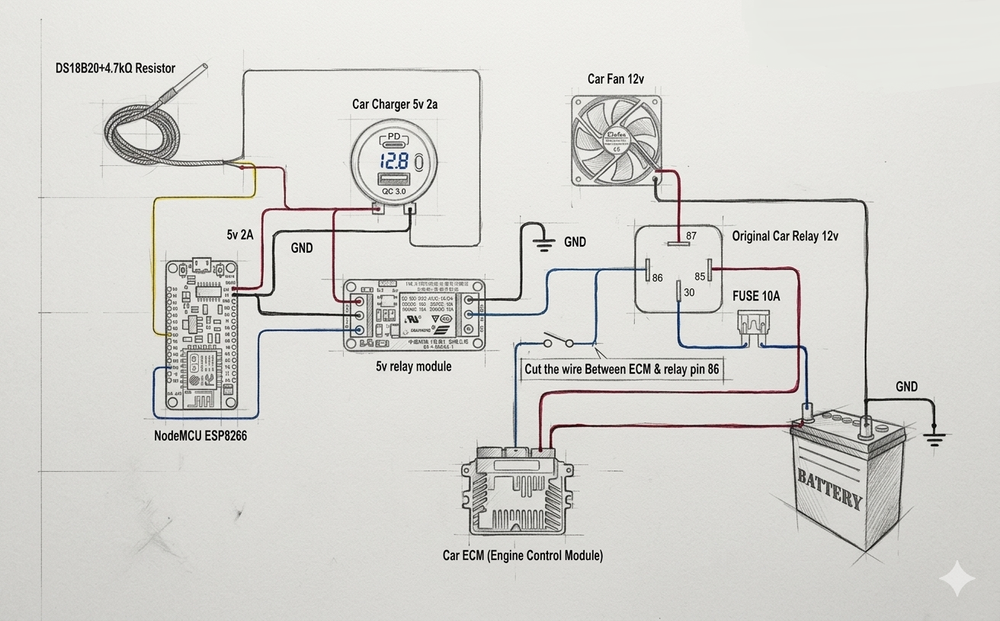
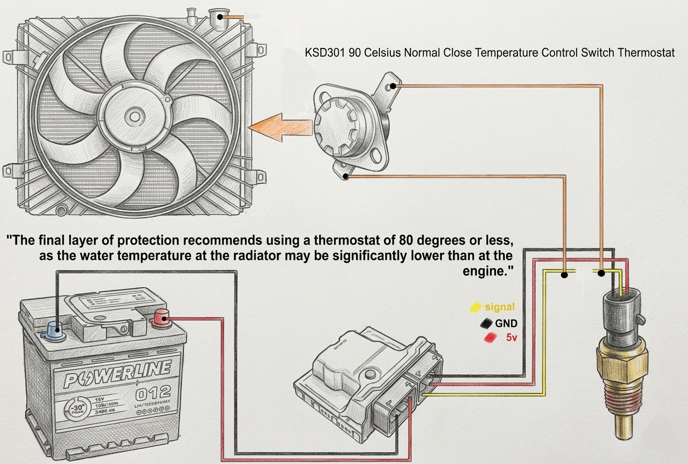
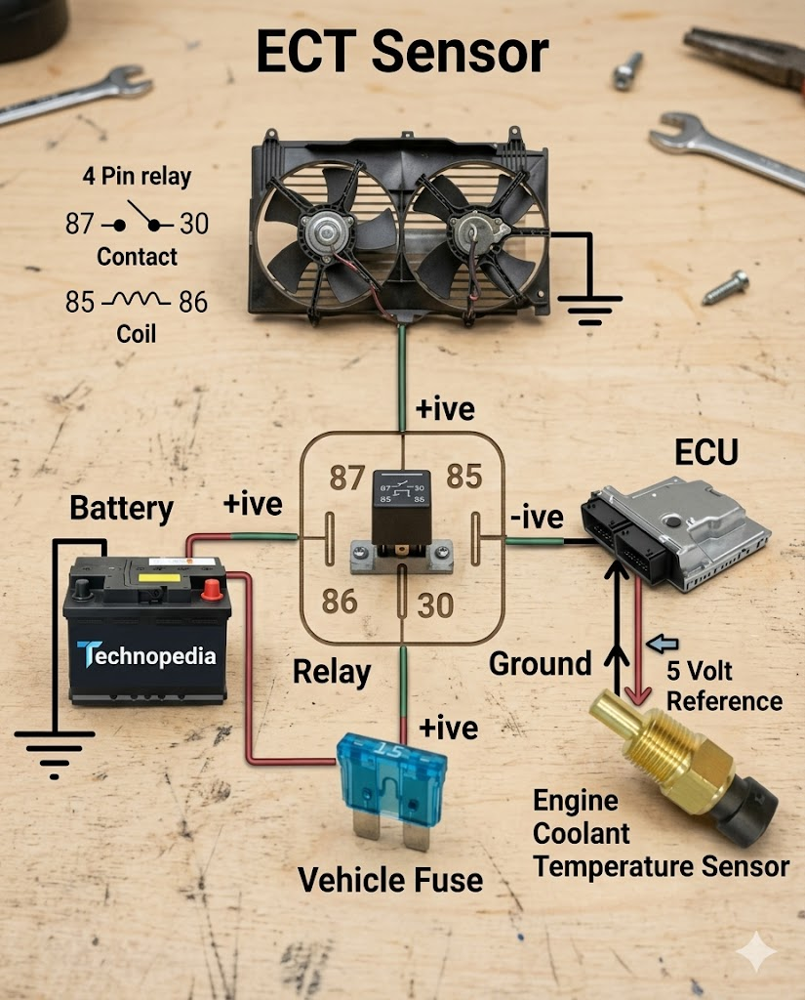
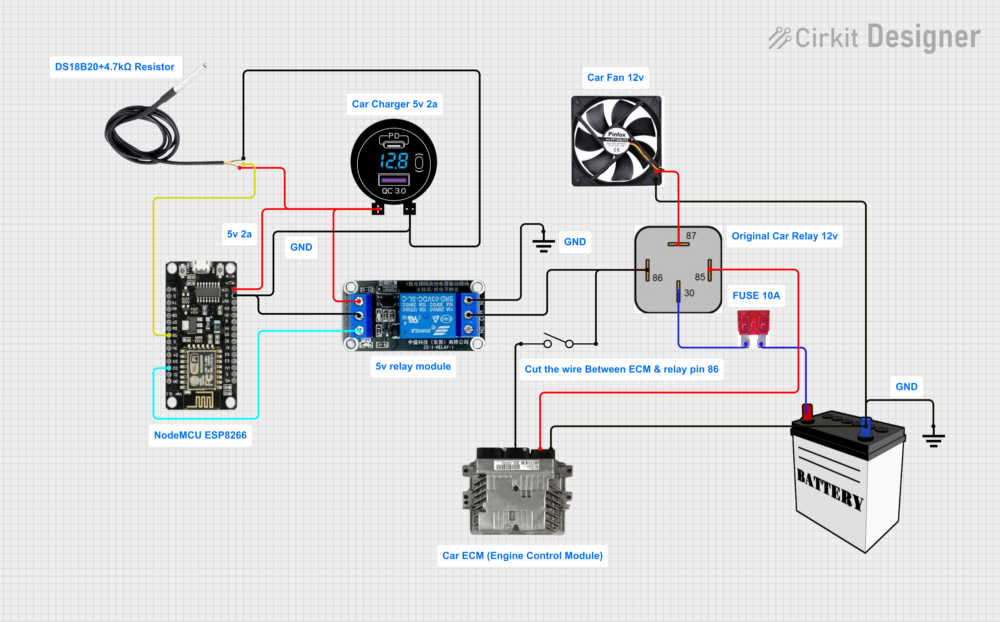

# Smart-Fan-Guardian (ESP8266) 🚗💨


**An Advanced Fail-Safe Cooling Controller for Automotive Radiator Fans**

---

## 📖 About This Project

This project is a robust, DIY embedded solution designed to replace or bypass a failing Engine Control Unit (ECU) fan controller. Unlike simple relay triggers found in typical tutorials, this system uses a **multi-layered safety architecture** to ensure the engine never overheats — even if the microcontroller, sensors, or power supply fails.

**Why this is different:** Most online projects stop at "ESP reads temp → triggers relay". This project implements **4 independent layers of protection**, including a physical thermal switch backup, OTA updates, and a real-time web dashboard. It has been battle-tested in a real vehicle for over **4 months**.

---

## 🌟 Key Features

| Feature | Description |
|---------|-------------|
| **Intelligent Control** | DS18B20 sensor with web-configurable temperature threshold |
| **OTA Updates** | Over-The-Air firmware updates — no need to open the hood! |
| **Web Dashboard** | Real-time temperature monitoring and manual override |
| **Dual Network Mode** | Works as both WiFi client and Access Point |
| **EEPROM Storage** | Settings persist after power loss |
| **Fail-Safe Logic** | Multiple independent protection layers (see below) |
| **Hardware Redundancy** | 90°C NC thermal switch — 100% mechanical backup |

---

<div align="center">
  <a href="circuit_fan_esp.png">
    
  </a>

  &nbsp;&nbsp;

  <a href="circuit_fan_thermo.png">
    
  </a>
</div>

## 🛡️ Multi-Layer Safety Architecture

┌─────────────────────────────────────────────────────────────────────────────┐
│ LAYER 4: HARDWARE THERMAL BACKUP (Independent Circuit) │
│ • 90°C NC thermal switch spliced into factory ECT sensor wire │
│ • When temp reaches 90°C → switch OPENS → ECU triggers fan │
│ • Works even if ESP is dead, power is lost, or software crashes │
│ • No code, no electronics — pure mechanical-electrical fail-safe │
├─────────────────────────────────────────────────────────────────────────────┤
│ LAYER 3: PHYSICAL WIRING (Fail-ON Logic) │
│ • Relay configured as NC (Normally Closed) │
│ • If ESP loses power → NC contact keeps relay coil grounded │
│ • Result: Fan runs continuously — safe state for overheating │
├─────────────────────────────────────────────────────────────────────────────┤
│ LAYER 2: SOFTWARE TEMPERATURE CONDITION │
│ • Fan operates in timed cycles (ON/OFF) ONLY when temperature │
│ exceeds user-defined threshold │
│ • Below threshold: Fan runs continuously (safe state) │
│ • Configurable via web interface (10°C - 100°C) │
├─────────────────────────────────────────────────────────────────────────────┤
│ LAYER 1: INTELLIGENT CONTROL (ESP8266 + Web Dashboard) │
│ • Real-time DS18B20 temperature monitoring │
│ • Configurable ON/OFF timing cycles │
│ • Manual override (Force ON / Force OFF) │
│ • OTA updates for remote firmware upgrades │
│ • Settings stored in EEPROM │
└─────────────────────────────────────────────────────────────────────────────┘

<div align="center">
  <a href="fan_wire.jpg">
    
  </a>
</div>


> **For detailed explanation of each layer**, see [`docs/safety_layers.md`](docs/safety_layers.md)

---

## 🔧 Intelligent Calibration & Thermal Protection

### Thermal Buffer Sensing
The DS18B20 is mounted on the **radiator outlet hose** using thermal compound. This provides:

- ✅ Protection from direct engine heat damage
- ✅ Stable readings without thermal shock
- ✅ Physical isolation from engine vibration

### Why the Hose?
The rubber hose acts as a thermal buffer (low-pass filter), protecting the sensor from sudden temperature spikes while still providing accurate readings after calibration.

---

## 📋 Hardware Requirements

| Component | Specification | Notes |
|-----------|--------------|-------|
| **ESP8266** | NodeMCU / Wemos D1 / ESP-01 | Any ESP8266 board works |
| **DS18B20** | Waterproof probe | Mounted on radiator hose with 4.7kΩ pull-up |
| **Relay Module** | 5V SPDT | Configured for **NC (Normally Closed)** operation |
| **Voltage Regulator** | 12V → 5V | For NodeMCU via USB car charger |
| **Thermal Switch** | 90°C NC Type | **Independent circuit** — see Layer 4 |
| **Car Charger** | 5V 2A USB | Powers the ESP8266 |

### Wiring Summary

| ESP8266 Pin | Connected To |
|-------------|--------------|
| D1 (GPIO5) | Relay Module Signal (Active HIGH) |
| D2 (GPIO4) | DS18B20 Data (with 4.7kΩ pull-up to 3.3V) |
| 3.3V | DS18B20 VCC |
| GND | DS18B20 GND + Relay Module GND |
| Vin (5V) | USB Car Charger (5V 2A) |

---

## 📂 Project Structure

ECM-FC-Auxiliary-Cooling-Bridge/
├── README.md # This file
├── ECM-FC-Auxiliary-Cooling-Bridge.ino # Main Arduino/ESP8266 source code
├── schematics/
│ ├── circuit_fan_esp.png # Main control circuit (ESP + Relay)
│ ├── circuit_fan_thermo.png # Layer 4: Independent thermal switch
│ └── fan_wire.jpg # Real wiring photo
├── docs/
│ └── safety_layers.md # Detailed explanation of all 4 layers
└── LICENSE # MIT License


---

## 🚀 Installation

### 1. Wiring
- **Main Circuit:** See `schematics/circuit_fan_esp.png`
- **Thermal Backup:** See `schematics/circuit_fan_thermo.png`
- **Real Photo:** See `schematics/fan_wire.jpg`

### 2. Upload Code
1. Open `ECM-FC-Auxiliary-Cooling-Bridge.ino` in Arduino IDE
2. Install required libraries:
   - `ESP8266WiFi`
   - `ESP8266WebServer`
   - `EEPROM`
   - `OneWire`
   - `DallasTemperature`
   - `ArduinoOTA`
3. Update WiFi credentials in the code:
   ```cpp
   const char* ssid = "YourWiFiSSID";
   const char* password = "YourWiFiPassword";

   Select your ESP8266 board and upload

3. First Connection
The ESP creates an AP named "TimerControl" with password "12345678"

Connect to this AP and navigate to http://192.168.4.1

Configure your home WiFi and settings via the web interface

4. OTA Updates (Optional)
After connecting to your home WiFi, you can upload new firmware wirelessly

OTA password is set to "ota123" (change in code for security)

Use Arduino IDE → Tools → Port → Network ports

📱 Web Dashboard Features
Once connected, access the ESP8266 IP address to view:

Section	Features
Status	Current temperature, fan status, time remaining in cycle
Manual Control	Force fan ON (emergency) / Force fan OFF / Return to auto
Settings	ON time (fan OFF), OFF time (fan ON), temperature threshold activation
Understanding the Logic
Mode	Description
Temperature Condition OFF	Timer runs continuously: Fan OFF for X min → Fan ON for Y min → repeat
Temperature Condition ON	Timer runs ONLY when temp ≥ threshold. Below threshold: Fan runs continuously (safe state)
Manual Stop	Fan ON immediately — emergency override
Manual Start	Returns to auto mode with fan OFF

🔬 How Low-Side Switching Works
This project uses low-side switching (controlling the negative terminal) for reliability:

[Car Relay Coil]
     │
     ├── Pin 85 ──► +12V (Ignition Switched)
     │
     └── Pin 86 ──► ESP Relay Module (COM)
                         │
                         └── NC ──► GND

<div align="center">
  <a href="circuit_1.png">
    
  </a>
</div>
                         

   Benefits:

ESP relay only handles 100-200mA (coil current), not fan current

No flyback diode needed (switching ground side minimizes sparking)

Inherent fail-safe: if ESP loses power, NC contact keeps GND connected → fan runs

⚠️ Disclaimer
This project involves working with automotive electrical systems. Improper installation may cause damage to your vehicle. The author assumes no responsibility for any damages incurred. Ensure proper fusing and wire gauges are used.

📄 License
MIT License — Feel free to use, modify, and distribute with attribution.

🤝 Acknowledgments
Built and tested on a real vehicle over 4 months

OTA updates for maintenance-free operation

Special thanks to the automotive electronics community

Made with 🔧 and 🧠 — Not just code, but engineering.


---

## 📝 docs/safety_layers.md ()

```markdown
# Multi-Layer Safety Architecture

This document explains the **4 independent protection layers** implemented in the Smart-Fan-Guardian project. Each layer is designed to work autonomously — if any layer fails, the remaining layers still protect the engine from overheating.

---

## Overview

┌─────────────────────────────────────────────────────────────────────────────┐
│ ENGINE TEMPERATURE │
│ │ │
│ ▼ │
│ ┌─────────────────────────────────────────────────────────────────────┐ │
│ │ LAYER 1: ESP8266 + DS18B20 + Web Dashboard │ │
│ │ • Real-time temperature monitoring │ │
│ │ • Configurable timing cycles │ │
│ │ • Manual override via web interface │ │
│ │ • OTA updates for remote maintenance │ │
│ └─────────────────────────────────────────────────────────────────────┘ │
│ │ │
│ ▼ (if sensor fails or temp exceeds) │
│ ┌─────────────────────────────────────────────────────────────────────┐ │
│ │ LAYER 2: Software Temperature Condition │ │
│ │ • Timer runs ONLY when temperature ≥ threshold │ │
│ │ • Below threshold: Fan runs continuously (safe state) │ │
│ │ • Prevents unnecessary cycling when engine is cool │ │
│ └─────────────────────────────────────────────────────────────────────┘ │
│ │ │
│ ▼ (if ESP loses power or crashes) │
│ ┌─────────────────────────────────────────────────────────────────────┐ │
│ │ LAYER 3: Physical Wiring (Fail-ON Logic) │ │
│ │ • Relay configured as NC (Normally Closed) │ │
│ │ • If ESP loses power → NC contact keeps relay coil grounded │ │
│ │ • Result: Fan runs continuously — safe state for overheating │ │
│ └─────────────────────────────────────────────────────────────────────┘ │
│ │ │
│ ▼ (if all electronics fail) │
│ ┌─────────────────────────────────────────────────────────────────────┐ │
│ │ LAYER 4: Hardware Thermal Switch (Independent Circuit) │ │
│ │ • 90°C NC thermal switch spliced into factory ECT sensor wire │ │
│ │ • When temp reaches 90°C → switch OPENS → ECU triggers fan │ │
│ │ • Works even if ESP is dead, power is lost, or software crashes │ │
│ │ • No code, no electronics — pure mechanical-electrical fail-safe │ │
│ └─────────────────────────────────────────────────────────────────────┘ │
│ │ │
│ ▼ │
│ RADIATOR FAN RUNS │
└─────────────────────────────────────────────────────────────────────────────┘


---

## Layer 1: ESP8266 Intelligent Control

### Components
- ESP8266 (NodeMCU / Wemos D1 / ESP-01)
- DS18B20 temperature sensor
- 5V relay module
- Web dashboard interface

### How It Works
1. The DS18B20 reads temperature from the radiator hose (calibrated offset applied)
2. The ESP runs a timing cycle: Fan OFF for X minutes → Fan ON for Y minutes
3. Web interface allows:
   - Real-time temperature monitoring
   - Adjusting ON/OFF timing
   - Manual override (Force ON / Force OFF)
   - OTA firmware updates

### Code Logic (from ECM-FC-Auxiliary-Cooling-Bridge.ino)
```cpp
// Timer cycle logic
if (isOn && (currentMillis - previousMillis >= onTime)) {
    digitalWrite(RELAY_PIN, LOW); // Turn fan ON
    isOn = false;
} else if (!isOn && (currentMillis - previousMillis >= offTime)) {
    digitalWrite(RELAY_PIN, HIGH); // Turn fan OFF
    isOn = true;
}
Failure Modes Handled
Sensor failure: Temperature reads -99.9°C → web interface shows error

WiFi failure: ESP still runs timer locally (settings in EEPROM)

Power cycle: Settings persist via EEPROM

Layer 2: Software Temperature Condition
How It Works
The timer cycle only activates when the engine temperature reaches a user-defined threshold:

Condition	Behavior
Temp < Threshold	Fan runs continuously (safe state — prevents overheating)
Temp ≥ Threshold	Timer cycle activates (Fan OFF for X min / ON for Y min)
Why This Matters
Prevents unnecessary fan cycling when engine is cold

Extends relay and fan motor lifespan

Still ensures cooling when engine reaches operating temperature

Configuration
Set via web interface:

Temperature Condition: Active / Inactive

Target Temperature: 10°C - 100°C

Code Logic

if (isTempConditionActive) {
    if (temperature != -99.9 && temperature >= targetTemp) {
        // Temperature reached → enable timer cycle
        isAutoMode = true;
        shouldAutoTimerRun = true;
    } else {
        // Below threshold → fan runs continuously (safe state)
        digitalWrite(RELAY_PIN, LOW); // Fan ON
        isAutoMode = false;
    }
}

Layer 3: Physical Wiring (Fail-ON Logic)
The Genius of NC Relay Configuration
Most DIY projects use NO (Normally Open) relays. This project uses NC (Normally Closed) for fail-safe operation.

How It's Wired

┌─────────────────┐     ┌─────────────────┐
│   ESP Relay     │     │  Car Relay      │
│                 │     │                 │
│  ┌───────────┐  │     │  ┌───────────┐  │
│  │    COM    ├──┼─────┼──┤   Pin 86  │  │
│  │           │  │     │  │           │  │
│  │    NC     ├──┼─────┼──┤    GND    │  │
│  └───────────┘  │     │  └───────────┘  │
│                 │     │                 │
│  Active HIGH   │     │  Pin 85 → +12V  │
│  (HIGH = OFF)  │     │  (Ignition)     │
└─────────────────┘     └─────────────────┘

Normal Operation
ESP sends HIGH (fan OFF) → relay coil energized → NC contact OPENS

Car relay coil circuit is OPEN → fan follows ESP timer logic

Failure Scenario (ESP loses power)
Relay coil de-energizes → NC contact CLOSES

Car relay coil now has GND → car relay activates → fan runs continuously

Why This is Critical
ESP crash? Fan runs.

Power supply fails? Fan runs.

WiFi lost? Fan runs (if timer would normally have fan ON anyway, but this ensures safe state)

Layer 4: Hardware Thermal Switch (Independent Circuit)
Overview
This is the ultimate backup layer — completely independent of all electronics. It uses the car's own ECU fail-safe logic.

How the ECU Fail-Safe Works
Most vehicles have a built-in safety feature: If the engine temperature sensor circuit is OPEN, the ECU activates the radiator fan.

This project exploits that feature.

The Wiring Modification

┌─────────────────┐     ┌─────────────────┐
│   Factory ECT   │     │      ECU        │
│     Sensor      │     │                 │
│                 │     │                 │
│  ┌───────────┐  │     │  ┌───────────┐  │
│  │  Signal   ├──┼─────┼──┤  Sensor   │  │
│  │           │  │     │  │  Input    │  │
│  └───────────┘  │     │  └───────────┘  │
│                 │     │                 │
│  ┌───────────┐  │     │  ┌───────────┐  │
│  │   GND     ├──┼─┐   │  │   GND     │  │
│  └───────────┘  │ │   │  └───────────┘  │
└─────────────────┘ │   └─────────────────┘
                    │
                    │   ┌─────────────────┐
                    └───┤ 90°C NC Thermal│
                        │     Switch      │
                        └─────────────────┘
                                │
                                ▼
                              GND

                              How It Works
Temperature	Switch State	ECU Sees	Fan Behavior
< 90°C	CLOSED	Normal sensor signal	ECU controls fan normally
≥ 90°C	OPENS	Open circuit	ECU triggers fan (fail-safe)
Why This is Genius
No electronics involved — just a mechanical thermal switch

Works even if all electronics fail — ESP dead, power lost, software crash

Uses the car's own fail-safe — you're not fighting the ECU, you're leveraging it

Redundant — completely independent from Layers 1-3

Summary: What Each Layer Protects Against
Failure Scenario	Layer 1	Layer 2	Layer 3	Layer 4
DS18B20 sensor fails	⚠️ Shows error	✅ Fan runs continuous	✅ Works	✅ Works
ESP crashes / hangs	❌ Fails	❌ Fails	✅ Fan runs	✅ Works
ESP loses power	❌ Fails	❌ Fails	✅ Fan runs	✅ Works
WiFi network down	⚠️ Local mode only	✅ Works	✅ Works	✅ Works
All electronics fail	❌ Fails	❌ Fails	❌ Fails	✅ Fan runs
Extreme overheating (90°C+)	✅ Can trigger	✅ Can trigger	✅ Works	✅ Guaranteed trigger
Installation Notes for Layer 4
Thermal Switch Selection
Use a 90°C Normally Closed (NC) thermal switch

Rated for automotive temperatures (usually -40°C to 150°C)

Choose one with appropriate current rating (at least 1A)

Wiring Instructions
Locate the factory engine coolant temperature (ECT) sensor

Identify the ground wire (not the signal wire — consult vehicle wiring diagram)

Cut this ground wire

Connect the thermal switch in series between the sensor ground and ECU ground

Mount the thermal switch to the engine block or thermostat housing using thermal compound

Testing
Use a heat gun or multimeter to verify the switch opens at 90°C

With engine cold, the switch should be closed (continuity)

When engine reaches 90°C, the switch should open → fan should activate regardless of other layers

Conclusion
This 4-layer architecture ensures your engine will never overheat, regardless of what fails. Each layer is designed to be independent and fail-safe, making this system suitable for real-world automotive use where reliability is critical.

The system has been tested in a real vehicle for over 4 months with zero failures.

Remember: Good engineering isn't about making things work when everything is perfect — it's about making things work when everything fails.


                         

This project implements **4 independent layers of protection**. Each layer works autonomously — if one fails, the others still protect your engine.
